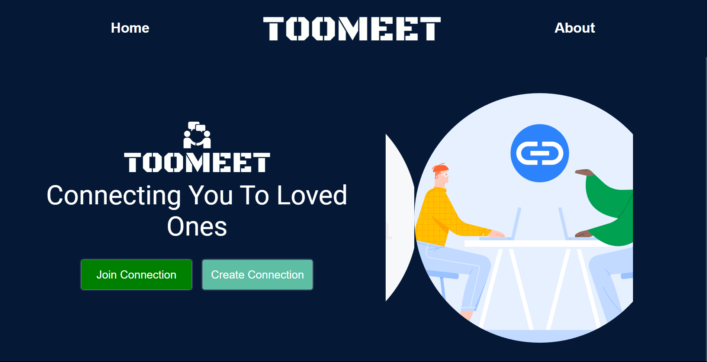
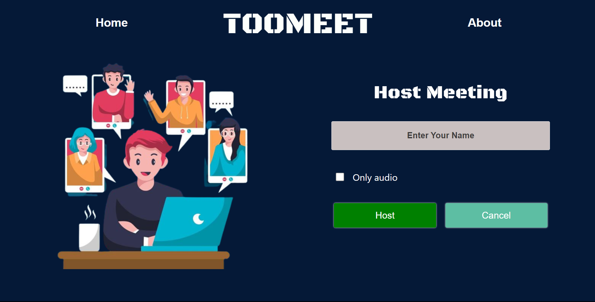
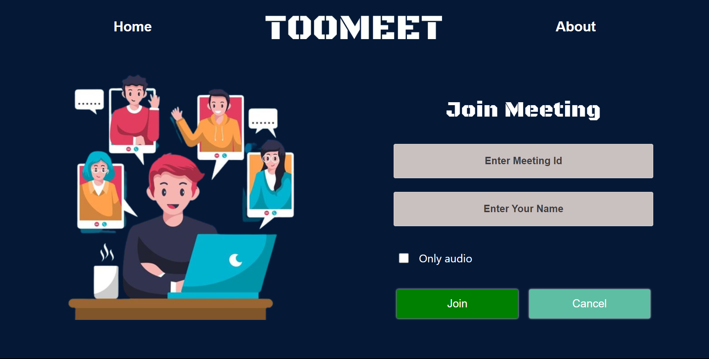
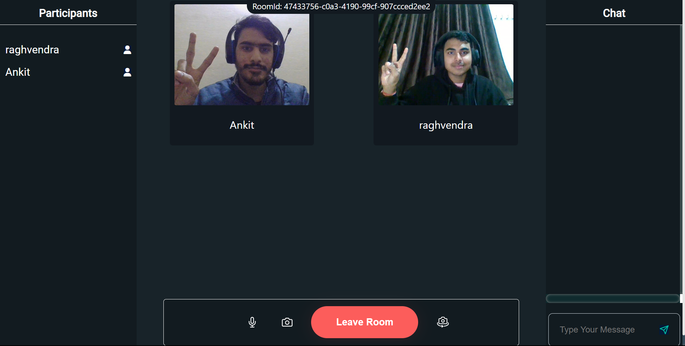

# Real Meet

REAL-MEET is Real Time Video Calling App, User Can connect with other people throught video and audio. It is Individual Project made with help of React , Chakra UI , NodeJS and ExpressJS and Socket.io.

## HomeSection

Home Section Have Two Buttons To Create Meeting and Join Meeting

## Join Page

Join Page have 2 section one is to create Meeting and another is to join meeting

 

## Meeting Room

Meeting Room have three section Participant Video and Chat given Below

